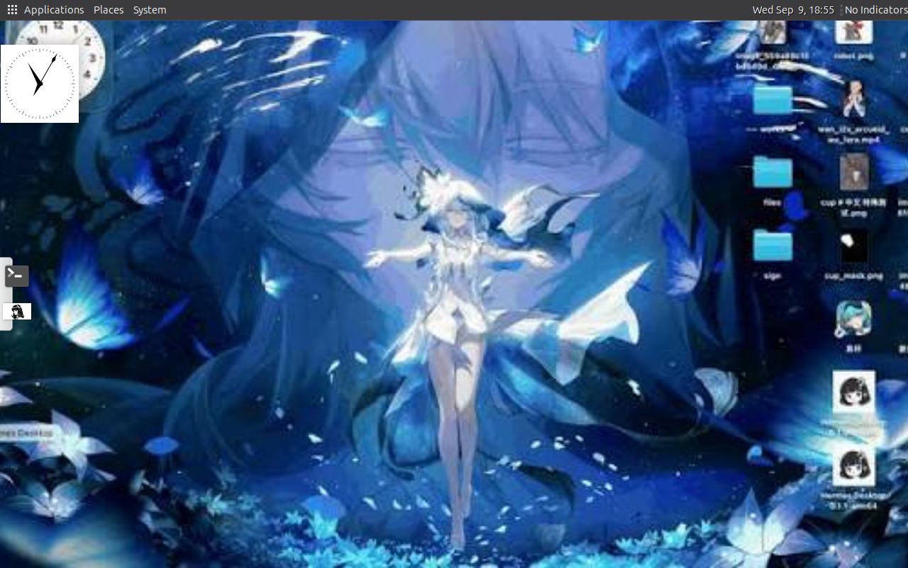

# Ubuntu MATE XRDP desktop with the Hermes Agent

The light edition of [ubuntu-xrdp](https://github.com/jjkh1673-tech/ubuntu-xrdp): the same complete
Ubuntu 26.04 LTS desktop in a Docker image, but with MATE 1.28 instead of XFCE, a smaller footprint,
and its own wallpaper. You open it with any RDP client and get a normal desktop, a terminal, root
through `sudo`, everyday applications and the upstream
[Hermes Agent](https://hermes-agent.nousresearch.com) already installed. The system is patched
during the build, so nothing has to be updated before you work, and a `System Upgrade` tool tells
you when a newer Ubuntu LTS exists and moves you to it without touching your files.

## Desktop preview

What a user sees after connecting over RDP, captured in a real `xfreerdp` session logged in as
`ubuntu` (1280x800, first login, nothing hand-edited afterwards):



## What is inside

| Part | Detail |
| --- | --- |
| Base | Ubuntu 26.04 LTS (resolute), every update applied at build time |
| Desktop | MATE 1.28 (marco window manager, mate-panel) over xrdp 0.10, single top panel, left dock (Plank) |
| User | `ubuntu` (uid 1000), passwordless `sudo`, RDP login |
| Terminals & editors | mate-terminal (dark palette, 10k scrollback), pluma, `vim`, `nano` |
| Everyday apps | Caja (files), engrampa (archives), eom (images), mate-calc, mate-system-monitor, mate-screenshot, htop |
| Development | git, curl, wget, jq, python3 (+venv/pip/tk), nodejs, npm, build-essential, cmake, gdb, ripgrep, shellcheck, openssh-client, nmap, tcpdump, dnsutils |
| AI | Hermes Agent installed by its own installer, plus `ai`, `hermes`, `hermes-agent`, `hermes-ai` commands and the `hermes desktop` GUI |
| Upgrades | `ubuntu-migrate` command, a `System Upgrade` entry in the menu and dock, and a login notice when a newer Ubuntu LTS exists |
| Ports | 3389/tcp (RDP) |

The panel layout is adjusted at build time rather than by hand after login: the stock menu bar
replaces the Brisk menu (the Mate-menu applet races at first login and leaves the button empty), the
panel clock applet is added to the top bar, and the bottom window-list panel plus the snap Firefox
launcher are removed from the layout file - snapd cannot exist inside a container.

## Requirements

- Docker installed and running (`docker --version` and `docker info >/dev/null && echo ok`).
- About 15 GB free disk (the finished image is roughly 12 GB) and 4 GB of RAM for the desktop.
- An RDP client: `Remmina` or `mstsc` (Windows), `Microsoft Remote Desktop` (macOS), `xfreerdp` (Linux).

## Run it

```bash
git clone https://github.com/jjkh1673-tech/ubuntu-mate-xrdp.git
cd ubuntu-mate-xrdp
docker build -t ubuntu-mate-xrdp .
docker run -d --name ubuntu-mate-xrdp -p 3389:3389 \
  -v ubuntu-mate-xrdp-home:/home/ubuntu \
  ubuntu-mate-xrdp
docker logs -f ubuntu-mate-xrdp    # stop with Ctrl-C once it says the desktop is ready
```

Then point an RDP client at `localhost` (port 3389) and log in:

```
user: ubuntu
password: 1122
```

The `-v ubuntu-mate-xrdp-home:/home/ubuntu` part is what keeps your files, shell history and Hermes
memory when you delete and recreate the container. Add it always.

### Publishing the image (optional)

CI only builds the image; nothing is pushed to a registry, because creating the package needs a
token with `write:packages`, which a workflow token does not get on a personal account. If you want
your own image in GHCR, tag and push it once:

```bash
echo <token with write:packages> | docker login ghcr.io -u <you> --password-stdin
docker tag ubuntu-mate-xrdp:26.04 ghcr.io/<you>/ubuntu-mate-xrdp:latest && docker push ghcr.io/<you>/ubuntu-mate-xrdp:latest
```

### First login: change the password

The image ships with the documented default password `1122` so that a personal machine or your own
codespace just works. On anything reachable from outside, change it before you connect anything else:

```bash
docker exec -it ubuntu-mate-xrdp su - ubuntu -c 'passwd'     # inside the container
# or set your own at start-up:
docker run -d --name ubuntu-mate-xrdp -p 3389:3389 -e XRDP_PASSWORD='Y0uRs3cret!' ubuntu-mate-xrdp
# or from inside the desktop: open a terminal and run  passwd
```

The first login also shows a welcome bubble with the same reminder.

### Connecting from another machine

Replace `localhost` with the host's address. Same credentials. If you expose 3389 to the internet,
change the password first and consider a VPN or an SSH tunnel:

```bash
ssh -N -L 3389:localhost:3389 you@that-host      # then connect to localhost:3389
```

### Using a GitHub Codespace instead of your own machine

1. In this repository open **Codespaces → New codespace** (the default 4 vCPU / 16 GB machine is
   what this image was built and verified on).
2. In the codespace terminal run the two `docker` commands from *Run it* above.
3. Open the **Ports** tab, find `3389`, and set *Port visibility* to **Public** if you want to reach
   it from another machine without a tunnel. Codespace ports are forwarded over HTTPS, so an RDP
   client must go through a tunnel instead:
   ```bash
   gh codespace ssh -c <codespace-name> -- -L 3389:localhost:3389
   ```
   then connect an RDP client to `localhost:3389`.
4. Your codespace is private to you even though this repository is public; nothing is shared with
   anyone else unless you hand out the address and the password.

## Root

The `ubuntu` user has full root with no password:

```bash
sudo -i        # uid=0(root)
```

Use it for packages, services and system files. It is deliberate, because the whole desktop is
already isolated in a container.

## Hermes in the terminal

The agent is installed the way its documentation says, for the `ubuntu` user, from
`https://hermes-agent.nousresearch.com/install.sh`. Its home is `~/.hermes` - inside the volume, so
it survives rebuilds.

```bash
ai                # or: hermes
hermes setup      # first run: pick a provider, paste the API key
hermes status
hermes doctor
```

No API key is baked into the image, and no wrapper replaces the real CLI - `ai` and `hermes` are the
same binary, so every upstream command and capability is available.

## Hermes Desktop

`hermes desktop` is the upstream app for this agent, so that is what is used here - it is compiled
into the image at build time and launched by:

- the **Hermes Desktop** icon on the desktop,
- the **Hermes** icon in the left dock,
- the `Hermes Desktop` entry in the Applications menu,
- `/usr/local/bin/hermes-desktop-launch` from a terminal.

It shares the same `~/.hermes` state as the terminal, so a chat you started in the terminal is where
you left it in the app. If you build a custom image without network access, the pre-build is
skipped with a warning and the first launch compiles it (a few minutes, once).

## Staying up to date

The image is fully patched at build time, so right after a fresh start there is nothing to install:

```bash
sudo apt-get update -qq && apt-get -s upgrade | tail -1     # 0 upgraded
```

For the desktop itself there is `ubuntu-migrate` (the **System Upgrade** icon in the dock and menu):

```bash
ubuntu-migrate --check              # current Ubuntu, newest LTS, exit code says if a move is due
ubuntu-migrate --plan               # the exact docker commands that swap the image, keeping the volume
ubuntu-migrate --apply              # refresh packages inside the running container (root)
ubuntu-migrate --migrate-lts        # Ubuntu's own do-release-upgrade, if you prefer in-place
ubuntu-migrate notifications off    # stop the login notice; 'on' turns it back
```

Once per release you get a notification when a newer LTS exists. It never installs anything on its
own. Because your `/home/ubuntu` is a volume, `--plan` is the safe path: pull the new image, recreate
the container, and every file, setting and Hermes state comes with you unchanged.

## Repository layout

```
Dockerfile                    the image: Ubuntu 26.04 + MATE + xrdp + tooling + Hermes
start.sh                      container entrypoint: dbus, audio, xrdp, then tails the RDP log
assets/apply-theme.sh         per-login session look (theme, icons, wallpaper, dock position)
assets/*.desktop              autostart entries: theme, plank, welcome notice, upgrade notice
assets/*.dockitem             what the left dock pins
assets/dconf-local            terminal colours and font, as a dconf system default
assets/ubuntu-migrate         the System Upgrade tool
assets/hermes-desktop-launch  launches `hermes desktop`
assets/wallpaper.jpg          the desktop background
.github/workflows/ci.yml      builds the image on every push
```

## Customising

- Wallpaper: replace `assets/wallpaper.jpg` and rebuild; `assets/apply-theme.sh` points the session
  at that path.
- Dock: edit the `assets/*.dockitem` files - one line each, pointing at a `.desktop` file.
- More packages: add them to the `apt-get install` list in the Dockerfile.
- No clock widget: the desktop is deliberately plain; the top panel keeps the stock MATE clock.

## Troubleshooting

| Symptom | Fix |
| --- | --- |
| RDP client says the certificate is untrusted | Expected: xrdp generates a self-signed certificate. Accept it or pass `/cert:ignore` to `xfreerdp`. |
| Login window appears and immediately disconnects | Wrong password, or the volume's `/home/ubuntu` is not writable: `docker logs ubuntu-mate-xrdp`. |
| Black screen after login | `docker exec ubuntu-mate-xrdp rm -f /home/ubuntu/.xsession-errors` then reconnect; if it repeats, `docker restart ubuntu-mate-xrdp`. |
| `xrdp: already running` after a restart | The entrypoint removes the stale pid files; if you replaced `start.sh`, keep `rm -f /var/run/xrdp/*.pid`. |
| No sound | Audio redirection is best-effort; check `/var/log/pulseaudio.log` inside the container. |
| Want a fresh desktop | `docker rm -f ubuntu-mate-xrdp && docker volume rm ubuntu-mate-xrdp-home` then run again. |

## Verified

Measured on a GitHub Codespace of this repository (`standardLinux32gb`: 4 vCPU, 16 GB RAM, root
through passwordless sudo), Docker 29.7.2, after `docker system prune -af` so the build started from
an empty image store. The RDP checks were done by driving a real `xfreerdp` client against the
container and typing the credentials into the login window.

<!--VERIFY-->

## Notes

- No API key, token or password other than the documented default is stored in the image.
- Firefox and Chrome are snap packages on Ubuntu and snapd cannot run inside this container, so a
  browser is not preinstalled; `xdg-open` and the Hermes browsing tools still work with any browser
  you install from a `.deb`.
- The XFCE and MATE editions are separate images with the same scripts, so picking one does not
  cost you any feature except the desktop itself.
